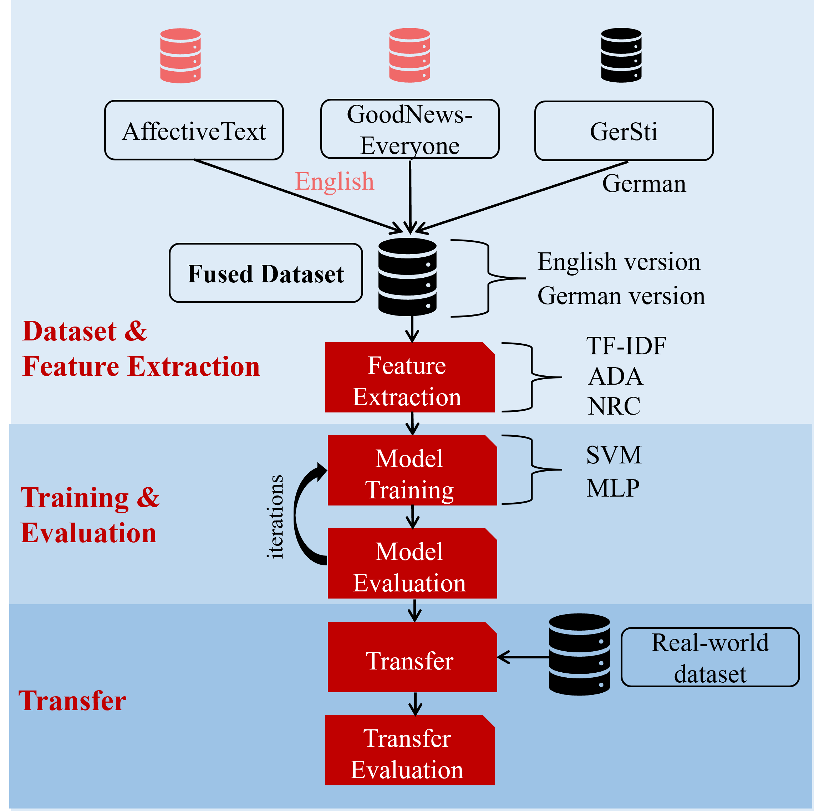

# Emotion Classification

> **Archived snapshot.** This is the code repository for the bachelor thesis *"Emotion Classification"*, completed November 2023 – February 2024 at Hochschule Karlsruhe (HKA), B.Sc. Data Science, in cooperation with DefineMedia GmbH.
>
> The code is preserved as-is for documentation and portfolio purposes. It is **not runnable**: it depended on DefineMedia's internal infrastructure (no longer accessible), and the datasets used are **not included** for copyright reasons. See the top-level repo README for details.

## Overview

<p align="center">
  
</p>

This project builds and evaluates emotion classification models for English and German news headlines. Multiple annotated datasets are combined into a fused corpus, several feature representations are extracted (lexical and embedding-based), classical and neural models are trained and evaluated, and the resulting models are transferred to a real-world dataset for final evaluation.

## Repository Structure

```
emotion-classification/
├── Preprocessing/            # Data preprocessing & feature engineering
│   ├── data_preprocessor.py
│   ├── feature_engineering.py
│   ├── feature_engineering_helper.py
│   ├── ada_embedder.py
│   ├── ada_inference.py
│   ├── bert_embedder.py
│   └── fasttext_inference.py
│
├── ModelTraining/             # Model training, sweeps & evaluation
│   ├── model_training.py
│   ├── nn_training.py
│   ├── nn_sweep.py
│   ├── evaluation.py
│   └── _utils/
│       ├── model_training_helper.py
│       ├── evaluation_helper.py
│       └── summary_plotter.py
│
├── Transfer/                  # Transfer to real-world data
│   └── transfer_real.py
│
├── Results/                   # Result artifacts (plots, logs, checkpoints)
│   ├── Preprocessing/          # Dataset histograms & cosine-similarity reports
│   ├── checkpoints/            # Saved model checkpoints
│   ├── experiments/            # Experiment logs (base/full, DE/EN)
│   └── img/summary_plots/      # Summary plots (performance, feature comparisons, CTR)
│
├── requirements.txt
└── README.md
```

## Pipeline

**1. Preprocessing** (`Preprocessing/`)
Raw dataset entries are cleaned and normalized (`data_preprocessor.py`), and multiple feature representations are extracted (`feature_engineering.py`, `feature_engineering_helper.py`):
- Embedding-based features via `ada_embedder.py` / `ada_inference.py` (OpenAI Ada embeddings) and `bert_embedder.py` (BERT embeddings)
- `fasttext_inference.py` for fastText-based inference
- Alongside lexical/affective features (e.g. TF-IDF, NRC lexicon)

Cosine-similarity comparisons and class-distribution histograms for the source datasets (SemEval-2007 Affective Text, GoodNews-Everyone, GerSti) are saved under `Results/Preprocessing/`.

**2. Model Training** (`ModelTraining/`)
- `model_training.py` — training of classical ML models (e.g. SVM, MLP)
- `nn_training.py` / `nn_sweep.py` — neural network training and hyperparameter sweeps
- `evaluation.py` — model evaluation
- `_utils/` — shared helpers for training, evaluation, and summary plotting

**3. Transfer** (`Transfer/`)
- `transfer_real.py` — applies trained models to a real-world dataset to evaluate generalization beyond the original training distributions

**4. Results** (`Results/`)
Contains generated artifacts from the steps above: preprocessing diagnostics, experiment logs (`experiments/`, split by base/full feature sets and German/English), model checkpoints (`checkpoints/`), and summary plots (`img/summary_plots/`) covering model performance, feature comparisons, and engagement metrics (CTR, impressions) for basic vs. complete emotion sets.

## Why This Code No Longer Runs

The original pipeline relied on DefineMedia GmbH's internal infrastructure for data access and parts of the processing environment. This access ended with the conclusion of the thesis project, so the pipeline cannot be re-executed in its original form.

## Datasets

The following datasets were used but are **not included** in this repository, for copyright reasons:

- SemEval-2007 Affective Text
- GoodNews-Everyone
- GerSti
- An internal real-world dataset provided via DefineMedia GmbH

The three public datasets can be obtained from their original sources if you wish to reproduce parts of this work; the DefineMedia real-world dataset is not publicly available.

## Setup (for reference only)

`requirements.txt` lists the Python dependencies used at the time. As noted above, the pipeline cannot currently be executed end-to-end due to the missing infrastructure and datasets, but the file is kept for reference.

```
pip install -r requirements.txt
```

## Results

Result artifacts — performance summaries, feature comparisons, and dataset diagnostics — are available under `Results/`. See the manuscript in the [main repository](..) for the full discussion and analysis.

## Related

- Full thesis manuscript and final presentation: see the [main repository](..)
- Contact: [LinkedIn](https://www.linkedin.com/in/torben-nattermann-a4919b211)
